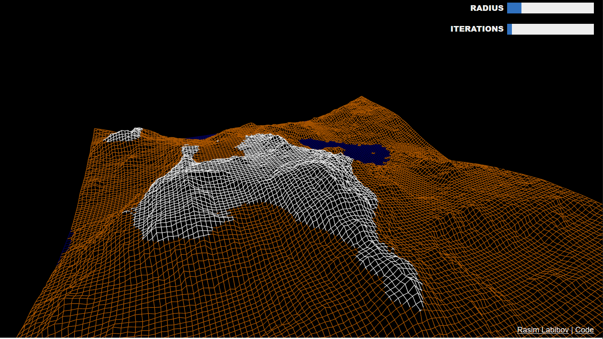

## Terrain Erosion

A model of hydraulic erosion of procedurally-generated terrain written in JavaScript using WebGL.

### Links

* [Erosion Demo](https://github.com/SebLague/Erosion-Demo) by Sebastian Lague.
